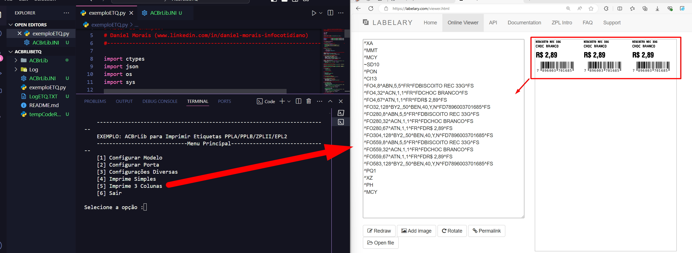

# ACBrLibETQ - Exemplo do uso em Python
### ACBrLib é  uma das bibliotecas criadas pelo Projeto ACBr
## Necessário download da biblioteca ACBrLib e suas dependências.

# Exemplo Python com ACBrLib 

### Autor: Daniel de Morais (https://www.youtube.com/user/infocotidiano/)

Criar a pasta ACBrLib\x64
Fazer o download da biblioteca e salvar a dll cdelc e dependencias (versao 64) dentro desta pasta ACBrLib\x64

Compativel com Impressoras de etiquetas na linguagens PPLA, PPLB, ZPL2 ou EPL

### linkedin, me add ai ! (www.linkedin.com/in/daniel-morais-infocotidiano)

Download:
> [https://www.projetoacbr.com.br/forum/files/file/438-acbrlibetq/](https://www.projetoacbr.com.br/forum/files/file/480-acbrlibetq-demo/)
